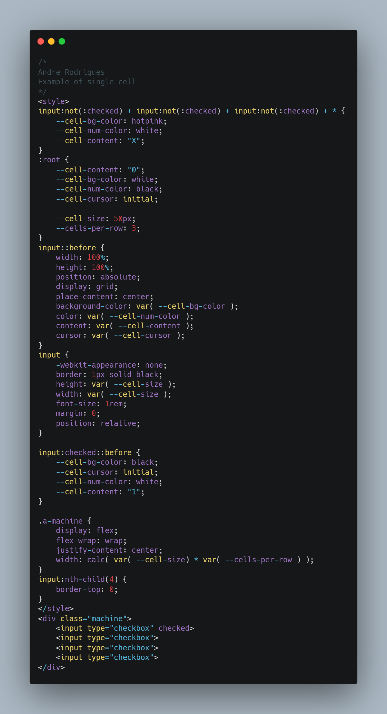

## Putting CSS programming into practice
 We already know that programming is a process of activities, so can we order our style sheets to fulfill an order? Before we see this in practice and have our answer, let's understand a little about Turing Complete languages
### What are Turing Complete languages?
 Turing Complete is a term used in the theory of computability in which it describes abstract machines, called automata. This automaton is treated as the definitive Turing Complete.
  
 A good part of the languages present in the programming world today is Turing Complete, except HTML, because, in turn, it alone does not allow operations. The HTML function is restricted to markup only. With all this, can we define that CSS is a Turing Complete language? Yes! But it only became Turing Complete in the CSS3 version, in previous versions it was not possible to simulate rule 101.
### Rule 101
 Cellular automata are rules for single cells in a grid to be 1 or 0. Here is a code example with a single cell example. The bottom cell will be only 1 when the first three are set to 1 0 0, which is the logic we programmed.
 
